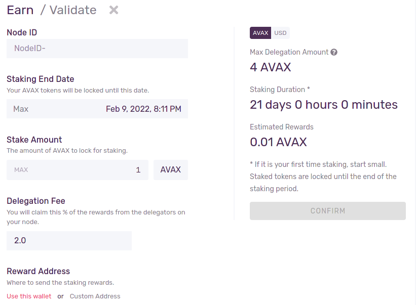

# Avalanche

- New Blockchain made to compete with Ethereum?
  - This is a controversial topic. Emin does not believe in Avalanche being a competitor to Etherium or to many of the other chains. He mainly believes in an ever growing blockchian space, where there is a multichain future, each chain with their own use case. 
    - [Chains are complementary](https://www.youtube.com/watch?v=PsBvxsaPw5I&t=1626s)
    - [Avalanche is not an Etherium Killer](https://www.youtube.com/watch?v=fb4uUN0RqOI)
- Very fast - Ethereum only can process about 15 transactions per second, while Avalanche can process over 4500 per second.
- Proof of Stake, rather than proof of work (Ethereum is moving to Proof of Stake with 2.0).
- 1:1 Ethereum smart contract compatible (Solidity).
  - Any app on etherium can be ported over to Avalanche due to the c-chain implementing an instance of EVM (Etherium Virtual Machine).
- Three separate, distinct blockchains - X Chain, P Chain, C Chain.
  - X Chain is for transferring between wallets, for example Chandler’s Wallet → Steve’s Wallet. Also where you can create assets.
  - C Chain is for running Smart Contracts. Also where ERC-20 Tokens and dApps are created & hosted.
  - P Chain is for staking and running validators. Validators is how the blockchain keeps in sync.
    - Uses the [Snowman Consensus Protocol](https://docs.avax.network/#snowman-consensus-protocol), which is how they keep the blockchain secure and scalable. More technical details [here](https://docs.avax.network/learn/platform-overview/avalanche-consensus).
- Avalanche is flexible from it subnets to its consensus
  - It is a base, like an OS and allows for customiszation.
    - [Emin's explaination regarding this](https://www.youtube.com/watch?v=PsBvxsaPw5I)
    - Has the ability to create subnets with new unique blockchains.
    - Supports private blockchains.
  - [Its Snow* consensus protocols are meant to tip](https://www.youtube.com/watch?v=Sfb8G54AM_4)
- [General techincal overview of Avalanche](https://www.youtube.com/watch?v=iEFFlu7q944)

## Governance

- Provides “on-chain” governance for certain network parameters.
  - “On-Chain” means that developers propose changes that the nodes of the chain can vote on whether to make the changes.
  - These can be changes like contract updates, interest rates on staking, etc.

## Wallet

- The [Avalanche Wallet](https://wallet.avax.network) is the official wallet for Avalanche and its token (AVAX).
- Is entirely written in Vue.js.
- Does not have a backend, is entirely frontend and can be hosted yourself.
- All of its functionality lives entirely on the public [Avalanche API](https://docs.avax.network/build/tools/public-api).
  - The actual requests this API abstracts away are super complex, so I would like to use this library.
  - [AvalancheJS](https://docs.avax.network/build/tools/avalanchejs/) is a Javascript wrapper for the API.
  - [AvalancheGo](https://github.com/ava-labs/avalanchego) is a Golang wrapper for the API.
    - Used by [Thresher](https://github.com/johnthethird/thresher), a multisig wallet for Avalanche.

## Staking

- Like Ethereum, requires the use of a node to stake.
  - Only node available at the current moment is [AvalancheGo](https://github.com/ava-labs/avalanchego).
- Unlike Ethereum, your money can stay in a secure wallet and does not go to a contract.

  - When you make a node, you get the node ID and tell the Avalanche Wallet the node’s ID as well as the staking duration and amount. You can also specify a delegation fee (typically 2%). See Figure A1

- You can actually get your money back now after staking is finished unlike Ethereum.
- There is no slashing of rewards or AVAX for falling behind. You always end with at least the AVAX you started with.
- There’s a [tool](https://stats.avax.network/dashboard/validator-health-check) to check on the status and health of your validator.
- Staking rewards are determined by vote of the entire network, currently hovering around 9.7% APY.

## Delegating

- Delegating is when you use another person’s node to stake AVAX.
- Node operators may take a percentage fee for allowing you to use their node (the delegation fee in Figure A1).
- When you delegate your tokens, you can choose a reward wallet address to send the rewards to.
- When delegation is finished, you get your tokens back at the address you sent them from.

## Subnets

- You can create subnets, which are derivative blockchains, on AVAX.
- These blockchains use their own currencies separate from AVAX, but are compatible with all other features.
- These blockchains can be clones of the X and C Chains, or completely custom VMs.
  - The custom VMs allow further decentralization and functionality.
- Can have their own validators with custom enforcement (like requiring certain hardware or disallowing validators in certain regions).

## Transaction Fees

- Fees are burned rather than rewarded.
- You can tip to increase your transaction priority.
- Fee is automatically deducted from one of the 3 chain addresses you control.

Here is the transaction fee table

| Chain | Type              | Fee (AVAX) |
| ----- | ----------------- | ---------- |
| P     | Create Subnet     | 1          |
| P     | Create Blockchain | 1          |
| P     | Add Validator     | 0          |
| P     | Add Delegator     | 0          |
| P     | Import AVAX       | 0.001      |
| P     | Export AVAX       | 0.001      |
| X     | Send AVAX         | 0.001      |
| X     | Create Asset      | 0.01       |
| X     | Mint Asset        | 0.001      |
| X     | Import AVAX       | 0.001      |
| X     | Export AVAX       | 0.001      |
| C     | Simple Send       | ≥ 0.001575 |

### C-Chain Fees

- Avalanche uses an algorithm to determine the base fee for a transaction.
  - Base fee is based on network load. Increases when load is high, decreased when load is low.
- _add more notes_ [https://docs.avax.network/learn/platform-overview/transaction-fees#dynamic-fee-transactions](https://docs.avax.network/learn/platform-overview/transaction-fees#dynamic-fee-transactions)

## Steve’s ETH/AVAX comparison

- Avalanche have 3 chains, don’t know what kind of communication is needed through them. RP uses an OracleDAO to communicate results from the ETH2 chain which has proof of stake to the ETH1 chain.
- Not sure what type of compatibility concerns with subnets, but I think there isn’t any. Any subnet can just provide a node address and start using the protocol. Just like any dApp or wallet or exchange could do the same.
- Avalanche has stated that lowering staking amount is important. Ethereum hasn’t. Lowering the staking amount doesn’t seem like a huge risk factor to GGP, since:
  - People will always want to run nodes at a cheaper value
  - Liquid staking is always valuable
  - The price of AVAX is going to go up. So if lowered to 100 AVAX, it can still cost like 100k or more.
  - For delegators, they have potential of lower fees and a trustless protocol
- GoGoPool would have its own tokenomics are still at play, which is a unique value
- Oracle nodes can create their own unbonded mini pools if absolutely necessary. Do we want that? What are the details on how that works?
- Penalties in Avalanche are different - Ethereum does slashing, Avalanche doesn't. an Avalanche node operator will always finish staking period with their full AVAX amount. The only penalty I know of so far is that they don’t get paid out the rewards. That might change the commission / insurance structure for GGP versus how it is for RP.
