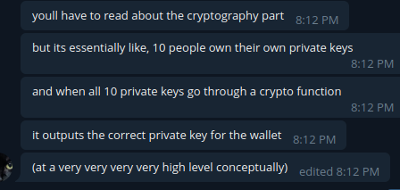

# Multisig Wallets

- Shared wallets where multiple people have private keys.
- Requires consent of all of the private key holders to access the wallet.&#x20;

- An Avalanche implementation of this that Steve likes is [Thresher](https://github.com/johnthethird/thresher).

## Thresher Wallet

- Multi Sig wallet for Avalanche.
- Has built in chat.
- Currently only supports X Chain.
- Entirely written in Go.

## What we need to do.

- Add support for P Chain addresses.
- Automate creation and use of multisig wallets using the exiting code.

## Setting up a new wallet

- Example command:

`thresher init avalanche fuji DAO-Treasury alice X-fuji1knjauvyjxf56tavysqnf9zxds084588nqja7j4`

- Command structure: `thresher init [blockchain network project nick address]`
- “avalanche” is the only blockchain supported.
- Network can be “mainnet” or “fuji” (testnet).
- Project is the name of the chatroom that can create shared wallets.
- Nick is the name you want to go by in the room.
- Address is the public address of your existing wallet.

### What happens when you call “init”

- [initProjectConfig](https://github.com/GoGoPool/thresher/blob/438fe1788adbb76bc9497ab75161aa70b06d79de/commands/init.go#L36) gets called.
- [Generates](https://github.com/GoGoPool/thresher/blob/438fe1788adbb76bc9497ab75161aa70b06d79de/user/me.go#L93) you a new Private and Public key for LibP2P and saves it to a user object that gets returned. This object is also where your nickname gets stored.
- Those keys get added to the new [AppConfig](https://github.com/GoGoPool/thresher/blob/438fe1788adbb76bc9497ab75161aa70b06d79de/config/config.go#L55), along with the wallet, project, network, and chain.
- The AppConfig then gets [saved](https://github.com/GoGoPool/thresher/blob/438fe1788adbb76bc9497ab75161aa70b06d79de/config/config.go#L106) as [JSON](https://github.com/GoGoPool/thresher/blob/438fe1788adbb76bc9497ab75161aa70b06d79de/config/config.go#L135).

## Loading a wallet

- Example Command: `thresher --config DAO-Treasury-alice.json --log alice.log wallet`
- Config specifies the wallet config you want to load.
- Log specifies log output.
- Wallet is the command

### On Startup.

- [This function](https://github.com/GoGoPool/thresher/blob/438fe1788adbb76bc9497ab75161aa70b06d79de/commands/wallet.go#L71) sets log output.
- [NewP2P](https://github.com/GoGoPool/thresher/blob/438fe1788adbb76bc9497ab75161aa70b06d79de/network/chat/p2p.go#L50) get called.
  - Handles nitty gritty [P2P networking](https://docs.libp2p.io/concepts/).
- A [chatroom](https://github.com/GoGoPool/thresher/blob/438fe1788adbb76bc9497ab75161aa70b06d79de/network/chat/chat.go#L138) gets joined and/or created.
- Network [connection](https://github.com/GoGoPool/thresher/blob/438fe1788adbb76bc9497ab75161aa70b06d79de/network/chat/chatnet.go#L17) is made.
- [New UI class](https://github.com/GoGoPool/thresher/blob/a7948a5eea6d94448e22d9126ae11c905075be9d/network/chat/ui.go#L193) is created.
- UI [runs on a loop](https://github.com/GoGoPool/thresher/blob/a7948a5eea6d94448e22d9126ae11c905075be9d/network/chat/ui.go#L212) until exit.

### When a new wallet is created.

- User sends a `/keygen` command.
- [generateKey](https://github.com/GoGoPool/thresher/blob/a7948a5eea6d94448e22d9126ae11c905075be9d/network/chat/ui.go#L284) gets called.
- Creates a [new empty wallet](https://github.com/GoGoPool/thresher/blob/438fe1788adbb76bc9497ab75161aa70b06d79de/network/chat/chat.go#L287) & runs [KeyGen](https://github.com/GoGoPool/thresher/blob/438fe1788adbb76bc9497ab75161aa70b06d79de/protocols/keygen.go#L16) command.
  - KeyGen uses the [MultiSig protocol.](https://github.com/GoGoPool/thresher/blob/438fe1788adbb76bc9497ab75161aa70b06d79de/protocols/keygen.go#L26)
  - This protocol is called [Secp256k1](https://en.bitcoin.it/wiki/Secp256k1), popularized by Bitcoin.
  - Uses the MultiPartySig library to encode and decode the [wallet key](https://github.com/GoGoPool/thresher/blob/438fe1788adbb76bc9497ab75161aa70b06d79de/wallet/avmwallet/avmwallet.go#L225).
  - [This function](https://github.com/GoGoPool/thresher/blob/438fe1788adbb76bc9497ab75161aa70b06d79de/wallet/avmwallet/avmwallet.go#L225) is the one where all the magic happens.
- Wallet waits for users to either confirm or deny.
  - If they deny, the wallet either just crashes (Steve’s report) or just leaves a co-routine run forever.
- Other users have to confirm that they want to generate the new wallet.
- If all users say yes, a new wallet is generated.
